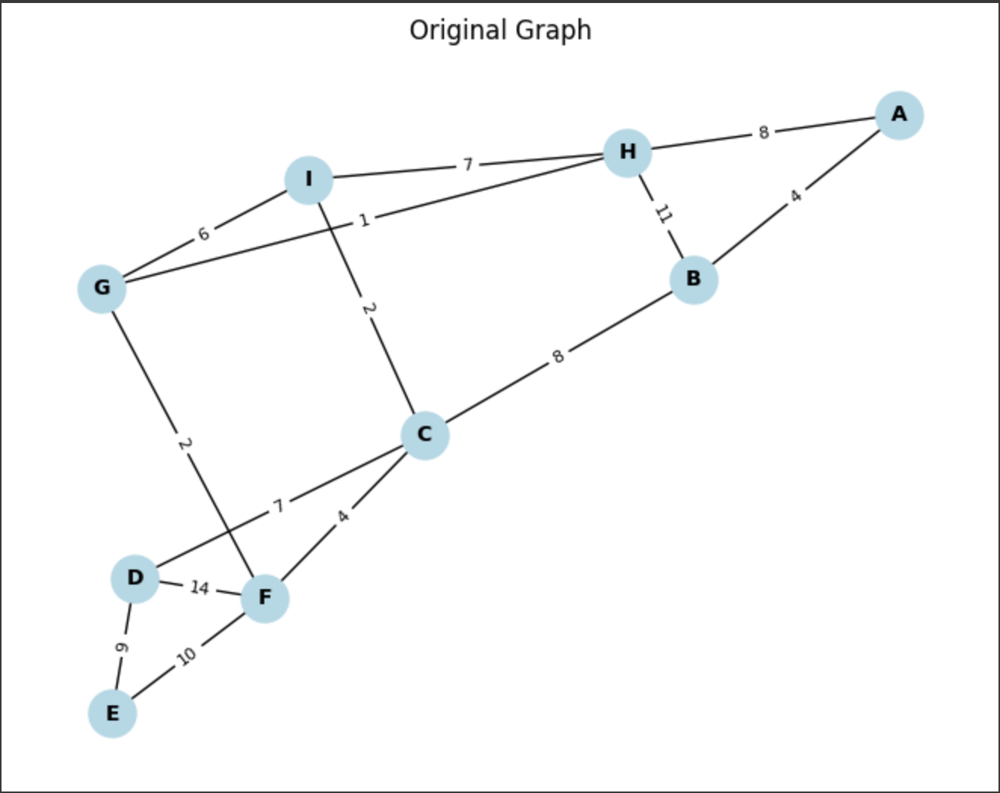
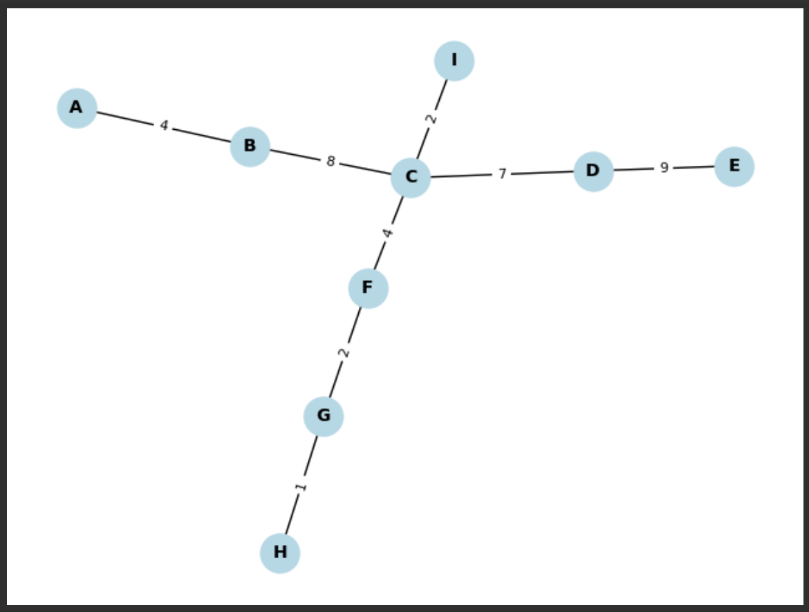

# Minimum Spanning Tree Algorithms: Prim's and Kruskal's

This project demonstrates the implementation of two essential graph algorithms, **Prim's Algorithm** and **Kruskal's Algorithm**, to compute the **Minimum Spanning Tree (MST)** for a weighted undirected graph. It also includes tools to visualize the original graph and the resulting MST using Python libraries like NetworkX and Matplotlib.

---

## Table of Contents
- [About the Project](#about-the-project)
- [Features](#features)
- [Technologies Used](#technologies-used)
- [Getting Started](#getting-started)
- [Usage](#usage)
- [Visualization](#visualization)
- [Applications](#applications)
- [Acknowledgments](#acknowledgments)

---

## About the Project

A **Minimum Spanning Tree (MST)** connects all nodes in a graph with the minimum total edge weight, ensuring no cycles. This project provides an efficient and visual way to solve MST problems for weighted graphs using:
1. **Prim's Algorithm** – A greedy algorithm that grows the MST one edge at a time.
2. **Kruskal's Algorithm** – A union-find-based algorithm that adds the smallest edges while avoiding cycles.

The project demonstrates key graph concepts and the practical implementation of MST algorithms.

---

## Features

- Implementation of **Prim's Algorithm** for MST generation.
- Implementation of **Kruskal's Algorithm** for MST generation.
- Graph visualization using **NetworkX** and **Matplotlib**:
  - Displays the original graph.
  - Displays the computed MST.
- Modular and extensible code for easy customization.
- Handles real-world graph scenarios with efficiency.

---

## Technologies Used

- **Python 3.8+**
- **NetworkX**: For graph representation and manipulation.
- **Matplotlib**: For graph visualization.
- **Heapq**: For efficient priority queue operations.

---

## Getting Started

### Prerequisites

Ensure you have the following installed:
- Python 3.8 or above
- Required Python libraries:
  - `networkx`
  - `matplotlib`

Install the libraries using pip:
```bash
pip install networkx matplotlib
```
### Installation
1. Clone this repository:
```bash
git clone https://github.com/Wafi-wahid/MinimumSpanningTree-OperationResearch-Python.git
```
2. Navigate to project diractory:
```bash
cd MinimumSpanningTree-OperationResearch-Python
```
### Usage
1. Open the mst.py file and modify the example_graph variable to represent your graph. Example:
   ```bash
   example_graph = {
    'A': [('B', 4), ('H', 8)],
    'B': [('A', 4), ('C', 8), ('H', 11)],
    'C': [('B', 8), ('D', 7), ('F', 4), ('I', 2)],}```
2. Run the script using:
```bash
python mst.py
```
3. The script will:
  - Print the MST and its total cost for both algorithms in the terminal.
  - Visualize the original graph and the computed MST using Matplotlib.

### Visualization
This project uses NetworkX and Matplotlib for graph visualization:
- Original Graph: Displays all nodes, edges, and weights.
- Minimum Spanning Tree: Highlights the edges included in the MST.
## Original Graph


## MST



### Applications
This project has real-world applications in:
- **Network Design:** Building cost-efficient fiber-optic, cable, or internet networks.
- **Transportation Planning:** Optimizing road or railway systems with minimal construction costs.
- **Power Grid Design:** Creating electrical networks with minimal wiring while ensuring full connectivity.
- **Cluster Analysis:** In machine learning, MSTs are used for hierarchical clustering.

### Acknowlegements
- **NetworkX:** For its powerful tools for graph representation and manipulation.
- **Matplotlib:** For providing effective data visualization capabilities.
- **Graph Theory:** The inspiration for solving real-world connectivity problems efficiently.


